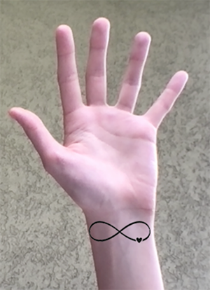

SUPSI 2022-23  
Corso d’interaction design, CV427.01  
Docenti: A. Gysin, G. Profeta  

Elaborato 2: Antologia a due mani  

# Tatuaggi
Autrice: Giulia Imperatori  
[MediaPipe demo-ES6] https://giuliaimperatori.github.io/tatuaggi/

## Introduzione e tema
Lo scopo di questo progetto è quello di realizzare un sito basato su una tematica scelta riguardante le mani, tra quelle proposte. Nel mio caso, ho elaborato un sito in cui mostro brevemente la storia dei tatuaggi, per poi raccontare attraverso un breve paragrafo e un'immagine ciascuno, i tatuaggi di varie culture fino ad arrivare ai giorni nostri.

## Riferimenti progettuali
Inizialmente ho cercato vari tatuaggi legati alle mani, per poi cercare le varie culture e i significati che esse attribuivano ai tatuaggi, ho inoltre cercato i metodi, per poi scoprire che essi non erano molto diversi fra loro.

https://i.pinimg.com/564x/d5/57/a0/d557a0768d7ba182354e9f5893b8b1a1.jpg
https://i.pinimg.com/originals/bc/a9/51/bca95104e42e1a2a0bee2120efc28e39.jpg
https://www.citimuzik.com/wp-content/uploads/2022/06/Rich-Small-Infinity-Tattoos.jpg

## Design dell’interfraccia e modalià di interazione
Ho selezionato alcune immagini, esempi di tatuaggi di varie culture, per poi semplificarle, eliminando lo sfondo e rendendole bianche in modo da poterle applicare su una pagina grigio scuro. Ho voluto aggiungere una gif che ho realizzato partendo da un'immagine png, per indicare il senso di scorrimento della pagina, per dare dinamicità alla pagina e perché ritenevo fosse un elemento interessante per il mio tema e per lo stile.
Infondo alla pagina, ho inserito un'interazione che permette di provare uno dei tatuaggi presenti negli esempi.

## Tecnologia usata
Mostrando la mano alla webcam, appena sotto il polso comparirà il tatuaggio d'esempio, questo grazie alla funzione Detector di MediaPipe.

if (detector && capture.loadedmetadata) {
		
		const hands = await detector.estimateHands(capture.elt, { flipHorizontal: true })

		if (hands.length == 1) {
		
			  const mano = hands[0]
   
        const polso = mano.keypoints [0]
          
			  image(infinitytattoo, polso.x-40, polso.y+20)
			  scale (0.5, 0.5)

## Target e contesto d’uso
Il target sono le persone interessate ai tatuaggi, il "virtual tattoo" potrebbe essere utilizzato sui siti web dei tatuatori o ad esempio nelle loro pagina instagram, sotto la sezione "effetti", dove sarebbe possibile aggiungere alcuni dei loro tatuaggi disponibili. In questo modo i clienti potrebbero provare i tatuaggi in modo virtuale prima che il disegno venga realizzato sulla loro pelle, potrebbero inoltre provare più varianti e in parti del corpo diverse.

https://github.com/giuliaimperatori/tatuaggi/assets/126774277/74eeabc4-8e26-4a94-9476-4b26f9b2a833

